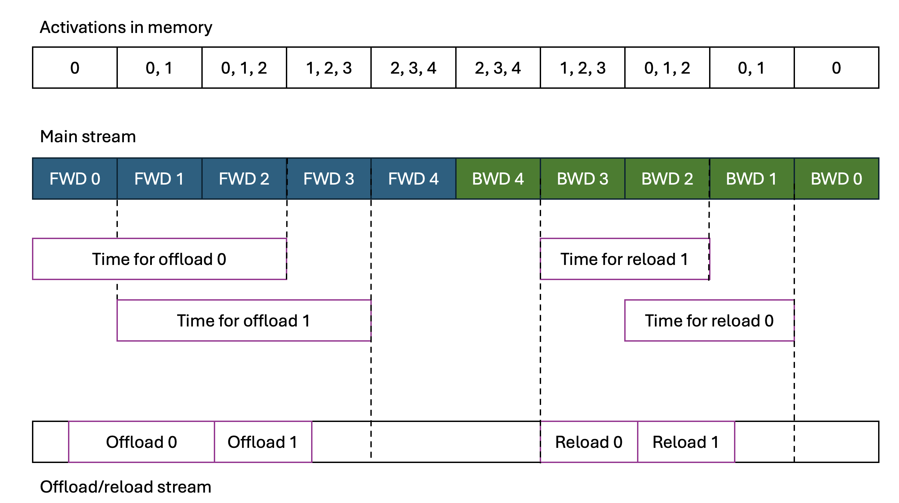

# CPU Offloading Refactor Design Doc

### 1. Applying offloading to non-TE models

The current implementation offloads only tensors saved for backward that are marked with `tensor.activation_offloading = True`. We want to automatically offload all tensors that are activations to make offloading easy to use. The decision about whether a tensor is an activation or, for example, a weight is made by heuristics (we do not offload `torch.nn.Parameter` instances, and we mark all weight tensors in TE—which are not `torch.nn.Parameter`s—with `.is_weight`). This works quite well.

The option `min_tensor_size_to_offload` was added to the offloading API to prevent offloading very small tensors.

### 2. Order of offloading and synchronization

The refactor changes the way layers are synchronized. The proposed algorithm for offloading `k` layers out of `n` is as follows:

1. We offload the first `k` layers.
2. Offloading of a tensor can start when it is saved for backward on the main stream. If the offload stream finishes all previous tasks and can start offloading a tensor, it waits for an event on the main stream representing saving this tensor for backward.
3. Reload of tensor `x` needs to finish before it is accessed in the backward pass—synchronization happens in the `tensor_pop()` hook.
4. Offload of layer `i` finishes before the forward pass of layer `n - k + i`; memory is released at that moment.
5. Reload of layer `i` starts after the backward pass of layer `n - k + i`; memory is allocated at that moment.
6. We offload in the order the layers appear in the forward pass and reload in reverse order during the backward pass.

This is illustrated for 5 layers, with 2 of them being offloaded, below:



With the offloading presented above, there are at most `n - k` activations present in memory, which is a logical consequence of offloading `k` layers. This scenario seems to be optimal in most cases.

For pipeline parallelism, the optimal synchronization algorithm is different, but we assume that points (2) and (3) are still valid. The things that need to change are:
1. When we wait for the offloading of each layer to finish to release its memory.
2. When we allocate memory for each reloaded layer and start reloads.
3. Which layers we want to offload.

There are different ways to expose that. For now, there is a dictionary argument to the offloading API like this:

```python
synchronization_dict: dict[int, tuple[bool, int, bool, int]] | None = None
```

If `None`, the number of offloaded layers is used to initialize the synchronization dictionary.

The dictionary maps layer IDs to tuples of `(offload_fwd, offload_num, reload_fwd, reload_num)`.

- Layer `i` is offloaded if and only if it is a key of the dictionary.
- Layer `i` will finish offload when `offload_num` layers begin their forward/backward pass (depending on `offload_fwd` being `True`/`False`, respectively).
- Layer `i` will start reload when `reload_num` layers start their forward/backward pass (depending on `reload_fwd` being `True`/`False`, respectively).

### 3. Offload improvements

Each layer’s tensors are grouped into one object called `TensorGroup`. Before offload starts, the following optimizations are performed on a group:

#### Interleaved tensors

In `MultiHeadAttention`, we use interleaved tensors. In the current implementation these tensors are offloaded as three separate tensors, which forces the use of a different kernel in the attention backward pass.

In the new implementation, we iterate through all tensors of `TensorGroup` and replace tensors that are a view on another tensor with their base tensor and the corresponding stride parameters. So all of `q`, `k`, `v` are replaced by the base tensor `qkv`. We offload/reload the `qkv` tensor, and after the reload we set `q`, `k`, and `v` to be proper views of this tensor.

#### Deduplication

Sometimes the same tensor can be saved for backward more than once. We look for identical tensors in a `TensorGroup` and remove duplicates.

#### Non-contiguous tensor offload

If we offload a non‑contiguous tensor on the offload stream, certain compute kernels are invoked. If all SMs are occupied, the offload stream needs to wait. Thus, we make offloaded tensors contiguous on main stream and print a warning that we changed the tensor layout.

### 4. Offloading of low-precision tensors

The refactor adds support for offloading all low‑precision tensors. Currently only `Float8Tensor` can be offloaded.

This is done by adding `.empty_like()` and `copy_()` support to the `QuantizedTensor` class. The offload‑related code uses these two functions and is precision‑agnostic.

### 5. Tests

The PR adds ~800 lines of complex offloading tests covering memory, numerics, overlap, and sanity. The offloading code is split into two parts: the internal class `OffloadSynchronizer` and the `get_cpu_offload_context()` function. This enabled us to test each part separately and catch more bugs.

### 6. Small fixes

#### Reference cycle bug

In the current code, hooks for backward are included in `GroupCommitFunction`, which is a no‑op being an instance of `torch.autograd.Function`. This causes some reference cycles in PyTorch. We changed that to hooks inserted by `tensor.grad_fn.register_prehook`, and the problem seems to disappear.

#### Double buffering

The double buffering feature allocates two copies of buffers during the forward pass and uses them during the backward pass. It aims to reduce memory fragmentation.

Without double buffering enabled, one can observe multiple `cudaFree()` calls in the profile when running close to peak memory.
We ran experiments and believe these calls are the result of Python’s poor handling of tensors allocated on different streams.

We ensure that all tensors are allocated on the main stream in the refactored code, and we think this is sufficient to deprecate double buffering.

### 7. Brief code explanation

The code is split into three parts:

1. Class `TensorGroupProcessor`: responsible for the offload improvements described in the Offload Improvements section.
2. Class `OffloadSynchronizer`: responsible for most of the offloading logic.
   - Methods `fwd_step(self) -> int` and `bwd_step(self, layer_num: int)` need to be called at the proper times; synchronization is handled in them.
   - Methods `push_tensor(self, tensor: torch.Tensor) -> int | torch.Tensor` and `pop_tensor(self, tensor_or_tensor_id: torch.Tensor | int) -> torch.Tensor` are used to save and access a single tensor.
3. Function `get_cpu_offload_context`, which exposes the offloading API.