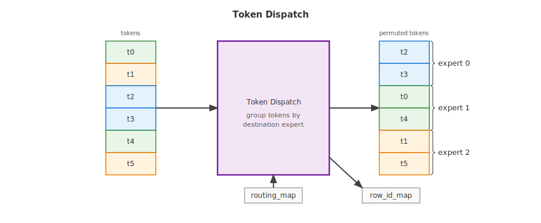
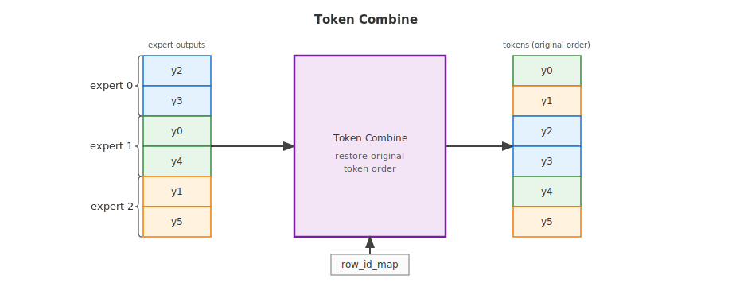
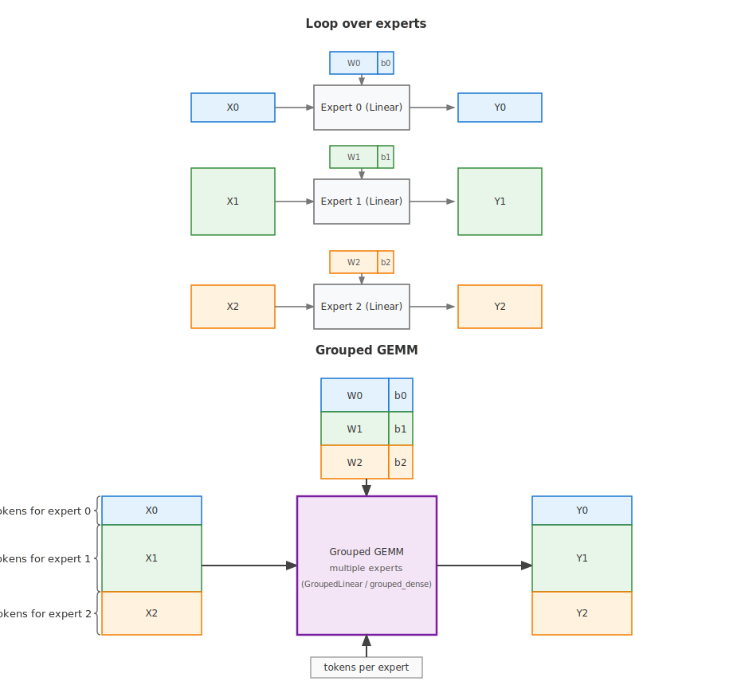

..
    Copyright (c) 2022-2026, NVIDIA CORPORATION & AFFILIATES. All rights reserved.

    See LICENSE for license information.

.. _moe-overview:

Mixture of Experts
==================

Mixture of Experts (MoE) layers replace a dense feed-forward network with a set
of expert networks and a router that sends each token to one or more experts.
This keeps the activated parameter count per token small while allowing the
model to scale to many more total parameters.

Transformer Engine provides two complementary groups of MoE building blocks:

* **Routing kernels** dispatch tokens to experts and combine expert outputs back
  into the original token order.
* **Grouped GEMM** primitives execute the expert linear layers efficiently
  once tokens are laid out in expert-contiguous blocks.

Routing Kernels
---------------

Transformer Engine provides routing kernels that move tokens between their
original order and the expert-contiguous layout expected by the grouped GEMM
(``GroupedLinear`` in PyTorch, ``grouped_dense`` in JAX). These paths use
optimized kernels instead of Python-level gather / sort / cat chains. The
rest of this section focuses on the two core operations - token dispatch and
token combine - because they illustrate the layout transformation used by the
other variants.

The snippets below show one concrete instance of this pattern: the mask-map
routing path, exposed in PyTorch as ``transformer_engine.pytorch.moe_permute``
and ``transformer_engine.pytorch.moe_unpermute``, and in JAX as
``transformer_engine.jax.permutation.token_dispatch`` and
``transformer_engine.jax.permutation.token_combine``. Other routing variants
(for example, index-map routing in PyTorch via ``map_type="index"``) are
available in both frameworks and follow the same pattern; see the
:doc:`PyTorch API reference <../api/pytorch>` and
:doc:`JAX API reference <../api/jax>` for the complete list and signatures.
The mask-map APIs have different framework-specific wrappers, but lower to
the same shared Triton permutation kernels, and both pairs are differentiable
so they can be used directly inside training graphs.

Token Dispatch
~~~~~~~~~~~~~~

Token dispatch is the canonical routing operation: given the original token
tensor and a routing map describing each token's destination expert, it returns
a permuted token buffer in which all rows assigned to the same expert are
stored contiguously. In PyTorch this operation is exposed as ``moe_permute``;
in JAX it is exposed as ``token_dispatch``. This is exactly the layout that
the grouped linear layer consumes via its per-expert token-count argument
(``m_splits`` in PyTorch ``GroupedLinear``, ``group_sizes`` in JAX
``grouped_dense``), so token dispatch followed by the grouped GEMM forms a
typical MoE forward block.

   Figure 1: Token dispatch consumes the input token tensor together with the
   routing map and produces an expert-contiguous token tensor; rows
   assigned to the same expert are stored back-to-back.

A typical call looks like:

.. tabs::

   .. tab:: PyTorch

      .. literalinclude:: moe_permute_pytorch.py
         :language: python
         :start-after: # START_MOE_PERMUTE_PYTORCH
         :end-before: # END_MOE_PERMUTE_PYTORCH

   .. tab:: JAX

      .. literalinclude:: moe_permute_jax.py
         :language: python
         :start-after: # START_MOE_PERMUTE_JAX
         :end-before: # END_MOE_PERMUTE_JAX

Both variants return the permuted token buffer of shape
``[num_out_tokens, hidden_size]`` together with a ``row_id_map`` that
carries enough information for token combine to restore the original token
order once the expert computation is done. Token dispatch and token combine
are typically used as a matched pair around the grouped GEMM call.

Token Combine
~~~~~~~~~~~~~

Token combine is the inverse routing operation: it takes the expert-contiguous
output produced by the grouped GEMM (or any per-expert computation) and the
``row_id_map`` returned by token dispatch, and returns a single tensor of
shape ``[num_tokens, hidden_size]`` with the rows written back into the
original token order. In PyTorch this operation is exposed as
``moe_unpermute``; in JAX it is exposed as ``token_combine``.

For top-1 routing each token has exactly one expert contribution, so
``merging_probs`` is omitted. For top-k routing pass the per-token expert
weights as ``merging_probs`` and the kernel computes a weighted sum of the
per-expert contributions in the same fused pass; without it the per-expert
contributions are summed unweighted.

   Figure 2: Token combine reads the expert-contiguous output tensor and the
   ``row_id_map``, and writes each row back to its original token slot. With
   ``merging_probs``, contributions from multiple experts to the same token are
   combined in the same fused kernel.

A typical call looks like:

.. tabs::

   .. tab:: PyTorch

      .. literalinclude:: moe_unpermute_pytorch.py
         :language: python
         :start-after: # START_MOE_UNPERMUTE_PYTORCH
         :end-before: # END_MOE_UNPERMUTE_PYTORCH

   .. tab:: JAX

      .. literalinclude:: moe_unpermute_jax.py
         :language: python
         :start-after: # START_MOE_UNPERMUTE_JAX
         :end-before: # END_MOE_UNPERMUTE_JAX

Together, token dispatch -> grouped MLP -> token combine form the inner block
of an MoE layer: the first kernel lays the tokens out for grouped GEMMs, the
grouped MLP computes all expert outputs (typically using ``GroupedLinear`` in
PyTorch or ``grouped_dense`` in JAX), and the last kernel restores (and
optionally merges) the per-token results.

Grouped GEMM
------------

The straightforward way to apply per-expert linear layers is to loop over the
experts and call a separate ``Linear`` for each one. This is correct, but it
is not the most efficient way to execute many expert GEMMs.

Transformer Engine provides a grouped GEMM primitive
(``GroupedLinear`` in PyTorch and ``grouped_dense`` in JAX) - an optimized
replacement that produces the same outputs as the loop while using
implementations that are better suited for MoE workloads.

Let ``G`` be the number of experts. For expert ``i``, ``X_i`` is the routed
token block, ``W_i`` is the expert weight, and ``b_i`` is the optional bias:

.. math::

   Y_i = X_i W_i^T + b_i,\quad i = 0, \ldots, G - 1

The full layer output is the concatenation of all expert outputs:

.. math::

   Y = \mathrm{concat}(Y_0, Y_1, \ldots, Y_{G-1})

The grouped GEMM is told how many token rows belong to each expert via a
per-expert token-count argument: ``m_splits`` in PyTorch ``GroupedLinear`` and
``group_sizes`` in JAX ``grouped_dense``.

   Figure 3: Both paths produce the same outputs from the same inputs. The
   baseline launches one ``Linear`` per expert, while the grouped GEMM
   (``GroupedLinear`` in PyTorch, ``grouped_dense`` in JAX) is an optimized
   grouped implementation that replaces the loop.

The following snippets show how to replace the loop with the grouped GEMM.
They assume the tokens have already been permuted into expert-contiguous order.

.. tabs::

   .. tab:: PyTorch

      .. literalinclude:: grouped_linear_pytorch.py
         :language: python
         :start-after: # START_GROUPED_LINEAR_PYTORCH
         :end-before: # END_GROUPED_LINEAR_PYTORCH

   .. tab:: JAX

      .. literalinclude:: grouped_linear_jax.py
         :language: python
         :start-after: # START_GROUPED_LINEAR_JAX
         :end-before: # END_GROUPED_LINEAR_JAX

The grouped GEMM uses implementations tuned for grouped expert execution:

* **Optimized backends:** Transformer Engine selects from several grouped GEMM
  backends depending on the framework, datatype, and GPU architecture. This
  can be, for example, cuBLAS GEMMs launched on multiple CUDA streams or a
  single grouped GEMM kernel, among other backend-specific implementations.
* **Recipe compatibility:** the grouped GEMM is integrated with
  Transformer Engine's :doc:`low-precision training stack
  <low_precision_training/index>`, so the same recipes available to regular
  ``Linear`` layers can be used for MoE experts.
* **Fused quantization:** Low-precision grouped GEMM paths can fuse
  quantization-related work such as scale computation, casting, and
  cast/transpose steps across experts instead of repeating the same work in a
  Python loop.
